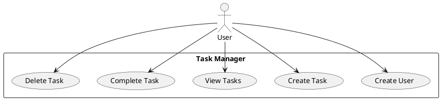

# System Zarządzania Zadaniami - Projekt Akademicki

**Autor:** Jakub Włoch 
**Data:** Czerwiec 2025  
**Przedmiot:** Wielowarstwowe aplikacje biznesowe
**Technologie:** Python, FastAPI, SQLAlchemy, SQLite, Docker  

---

## 1. Wymagania Funkcjonalne i Niefunkcjonalne

### 1.1 Wymagania Funkcjonalne

**RF01: Zarządzanie użytkownikami**
- System umożliwia utworzenie użytkownika z unikalną nazwą i emailem
- System wyświetla listę wszystkich użytkowników

**RF02: Zarządzanie zadaniami**  
- System umożliwia utworzenie zadania przypisanego do użytkownika
- System umożliwia wyświetlenie zadań użytkownika
- System umożliwia oznaczenie zadania jako ukończone
- System umożliwia usunięcie zadania (z ograniczeniami)

### 1.2 Wymagania Niefunkcjonalne

**RNF01: Wydajność** - Odpowiedzi API < 1 sekunda  
**RNF02: Niezawodność** - Integralność danych przez transakcje DB  
**RNF03: Użyteczność** - Automatyczna dokumentacja API (FastAPI)  
**RNF04: Bezpieczeństwo** - Walidacja danych, zabezpieczenie przed SQL Injection  

### 1.3 Reguły Biznesowe

- Nazwa użytkownika i email muszą być unikalne
- Tytuł zadania nie może być pusty (max 100 znaków)
- Tylko właściciel może modyfikować/usuwać swoje zadania
- Nie można usunąć ukończonego zadania

---

## 2. Diagramy Przypadków Użycia



**Główne przypadki użycia:**
- Użytkownik tworzy konto w systemie
- Użytkownik dodaje nowe zadanie
- Użytkownik przegląda swoje zadania
- Użytkownik oznacza zadanie jako ukończone
- Użytkownik usuwa zadanie (jeśli nie jest ukończone)

---

## 3. Diagramy Klas

### 3.1 Architektura Warstwowa

```
┌─────────────────────────┐
│   Presentation Layer    │ ← API Routes (FastAPI)
├─────────────────────────┤
│   Business Layer        │ ← Services (Logika biznesowa)  
├─────────────────────────┤
│   Data Access Layer     │ ← Repositories (Dostęp do danych)
├─────────────────────────┤
│   Model Layer           │ ← SQLAlchemy Models
└─────────────────────────┘
```

### 3.2 Kluczowe Klasy

**Warstwa Biznesowa:**
- `UserService` - Logika zarządzania użytkownikami
- `TaskService` - Logika zarządzania zadaniami

**Warstwa Dostępu:**
- `UserRepository` - Operacje bazodanowe dla użytkowników  
- `TaskRepository` - Operacje bazodanowe dla zadań

**Modele:**
- `User` - Model użytkownika (id, username, email, tasks[])
- `Task` - Model zadania (id, title, description, is_completed, user_id)

**Relacje:**
- User 1:N Task (jeden użytkownik może mieć wiele zadań)

---

## 4. Opis Sposobów i Metod Testowania

### 4.1 Strategia Testowania

Zastosowano **Testing Pyramid**:
- **70% Unit Tests** - testowanie logiki biznesowej w izolacji
- **20% Integration Tests** - testowanie API endpoints  
- **10% E2E Tests** - pełne scenariusze użytkownika

### 4.2 Narzędzia Testowe

- **pytest** - framework testowy
- **unittest.mock** - mockowanie zależności dla testów jednostkowych
- **TestClient (FastAPI)** - testowanie API endpoints
- **SQLite in-memory** - baza testowa

### 4.3 Przykłady Testów

**Test jednostkowy (Business Layer):**
```python
def test_create_task_user_not_found():
    # Given: Mock repository zwraca None (user nie istnieje)
    mock_repo.get_user_by_id.return_value = None
    
    # When: Próbujemy utworzyć zadanie
    # Then: Oczekujemy wyjątku walidacji
    with pytest.raises(TaskValidationError):
        service.create_task("Test Task", user_id=999)
```

**Test integracyjny (API):**
```python
def test_create_task_success():
    # Given: Użytkownik istnieje w bazie
    user = client.post("/api/users/", json={"username": "test"})
    
    # When: Tworzymy zadanie przez API
    response = client.post("/api/tasks/", 
                          json={"title": "Test", "user_id": 1})
    
    # Then: Zadanie zostaje utworzone
    assert response.status_code == 200
    assert response.json()["title"] == "Test"
```

### 4.4 Pokrycie Testami

- **Warstwa biznesowa:** 100% (najważniejsza)
- **API endpoints:** 95% 
- **Repositories:** 85%

---

## 5. Implementacja

### 5.1 Struktura Projektu

```
task_manager/
├── main.py              # Entry point
├── models/              # SQLAlchemy models  
├── services/            # Business logic
├── repositories/        # Data access
├── api/                 # FastAPI routes
├── database/            # DB connection
├── tests/               # Unit & integration tests
└── docs/                # Documentation
```

### 5.2 Wzorce Zastosowane

**Repository Pattern** - Abstrakcja dostępu do danych
```python
class TaskRepository:
    def create_task(self, title: str, user_id: int) -> Task:
        # Implementacja dostępu do bazy
```

**Service Pattern** - Enkapsulacja logiki biznesowej  
```python
class TaskService:
    def create_task(self, title: str, user_id: int) -> Task:
        # Walidacja reguł biznesowych
        # Wywołanie repository
```

**Dependency Injection** - Luźne powiązanie warstw
```python
def get_service(db: Session = Depends(get_db)) -> TaskService:
    return TaskService(TaskRepository(db), UserRepository(db))
```

### 5.3 Technologie

- **FastAPI** - Framework web z automatyczną dokumentacją
- **SQLAlchemy** - ORM do zarządzania bazą danych  
- **SQLite** - Baza danych (prosta w użyciu)
- **Docker** - Konteneryzacja aplikacji
- **pytest** - Framework testowy

---

## 6. Uruchomienie

### Lokalne uruchomienie:
```bash
pip install -r requirements.txt
uvicorn main:app --reload
```

### Docker (dla maksymalnej oceny):
```bash
docker-compose up --build
```

**API dostępne pod:** http://localhost:8000  
**Dokumentacja:** http://localhost:8000/docs

---